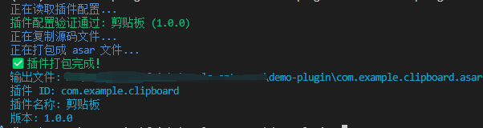

# Plugin Pack - 插件打包命令工具

专门用于将插件项目打包成 asar 格式的命令行工具。它可以帮助开发者快速打包插件项目，并确保生成符合标准的插件包。

## 安装

安装到项目：
```bash
npm install git+https://github.com/frontend-camp-25-12/plugin-pack
```
或全局安装
```bash
npm install -g git+https://github.com/frontend-camp-25-12/plugin-pack
```

## 使用方法

```bash
npx plugin-pack <source> [options]
```

### 参数说明

- `<source>`: 插件**产物**目录路径（必需）
- `-p, --plugin <path>`: plugin.json 文件路径（可选，不提供则在当前目录pwd查找）

**产物**的要求：
- 对于简单的纯web开发的插件，不需要额外处理，开发文件夹可以视作可直接运行的插件。
- 如果使用了ui库、导入了其它npm包，产物应该包含运行你的插件所必须的所有外部依赖。
- 对于renderer：构建成能在浏览器中运行的产物，比如用了react，那么react运行时需要被打包进去（renderer大概不需要你来额外进行改动，毕竟要在electron里面开发调试、看到效果，总要构建成前端产物的）。
- 对于preload：如果require了electron之外的外部模块，需要使用构建工具将所需的模块一并打包到preload产物中。这样打包之后才能正确运行。可以考虑用vite(rollup)或者webpack，仅externalize electron，把你的preload打包成一个嵌入了外部依赖的最终文件。

### 示例

```bash
# 基本用法 - 在当前目录(.)查找 plugin.json
plugin-pack .

# 指定插件产物目录路径和 plugin.json 路径
plugin-pack ./my-plugin -p ./my-plugin/config/plugin.json
```

## 使用场景

### 1. 简易插件项目

对于简单的插件项目，开发工作区通常包含以下文件：

```
my-plugin/
├── plugin.json     # 插件配置文件
├── preload.js      # 预加载脚本
├── index.html      # 插件主页面
└── assets/         # 资源文件
    ├── icon.png
    └── styles.css
```

使用
```shell
plugin-pack .
```
即可打包当前目录下的插件项目。

### 2. Electron-Vite 项目

对于使用 electron-vite 构建的项目，项目结构通常如下：

```
my-electron-plugin/
├── plugin.json         # 插件配置文件
├── package.json        # 项目配置
├── src/               # 源码目录
│   ├── main/
│   ├── preload/
│   └── renderer/
└── out/               # 构建产物目录
    ├── main/
    │   └── index.js   # 主进程入口
    ├── preload/
    │   └── index.js   # 预加载脚本
    └── renderer/
        └── index.html # 渲染进程页面
```

在 electron-vite 项目中，`package.json` 设置了构建产物的入口：

```json
{
  "main": "out/main/index.js"
}
```

**`plugin.json` 中的路径必须相对于构建产物目录**：

```json
{
  "id": "my-plugin",
  "name": "我的插件",
  "description": "基于 electron-vite 构建的插件",
  "version": "1.0.0",
  "preload": "preload/index.js",     // 注意：相对于 out 目录，即打包的根目录
  "content": "renderer/index.html",   // 注意：相对于 out 目录，即打包的根目录
}
```

#### 使用步骤：

1. 构建项目：

```bash
npm run build
# 或
electron-vite build
```

2. 打包插件（将构建产物 `out` 目录作为被打包目录）：

```bash
plugin-pack ./out
```

3. 生成插件包：`my-electron-plugin.asar`
